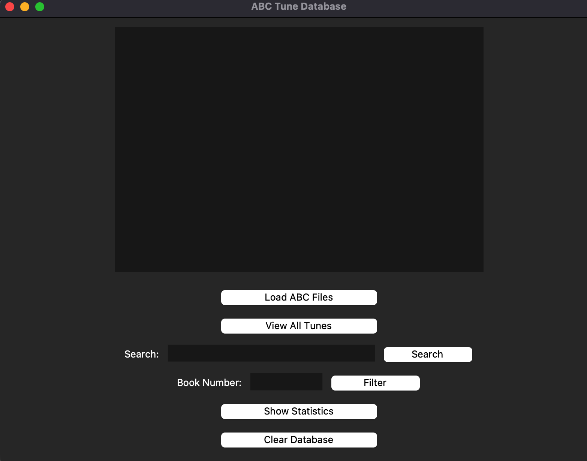
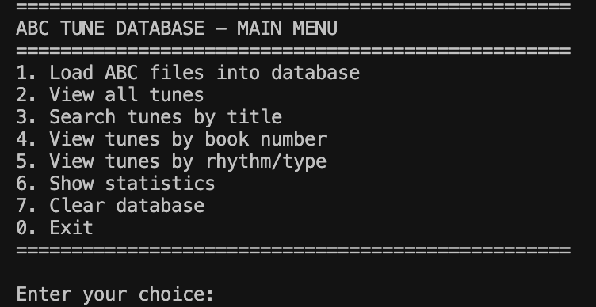

# Data Centric Programming Assignment 2025

- [Assignment Brief](assignment.md)

Name: Illya Mikava

Student Number: C24357241

# Screenshots

   ## GUI Main Window
   

   ## CLI Interface
   

# Description of the project

This project is an ABC Tune Database Management System that allows users to store, search, and analyze traditional music tunes written in ABC notation. The system provides both a Command-Line Interface (CLI) and a Graphical User Interface (GUI) for interacting with the database.

The application parses ABC music notation files from a folder structure, extracts metadata (title, key, meter, rhythm, composer, etc.), stores this information in a MySQL database, and provides various search and statistical analysis features.

# Instructions for use

## Prerequisites
- Python 3.x installed
- MySQL server running locally
- Required Python packages: `mysql-connector-python`, `pandas`, `tkinter`

## Setup
1. Ensure MySQL is running on localhost
2. Create a database named `abc_tunes`
3. Place your ABC files in the `abc_books` folder, organized by book number (e.g., `abc_books/1/`, `abc_books/2/`)

## Running the GUI Version
```bash
python GUI.py
```

## Running the CLI Version
```bash
python main1.py
```

## Features
- **Load ABC Files**: Parse and import all ABC notation files into the database
- **View All Tunes**: Display all tunes with their metadata
- **Search by Title**: Search for tunes by title (case-insensitive)
- **Filter by Book**: View all tunes from a specific book number
- **Filter by Rhythm**: Find tunes by rhythm/type (e.g., jig, reel, hornpipe)
- **Statistics**: View comprehensive statistics including tune counts, popular rhythms, common keys, and data completeness
- **Clear Database**: Remove all tunes from the database

# How it works

## Architecture

The project consists of four main Python modules:

### 1. abc_parser.py
- **`parse_abc_file(filepath, book_number)`**: Reads an individual ABC file line by line, extracting header fields (X:, T:, M:, K:, R:, C:, etc.) and creating tune dictionaries
- **`load_all_abc_files(base_folder)`**: Recursively scans the directory structure, identifies book numbers from folder names, and aggregates all parsed tunes

### 2. database.py
- **`connect_database()`**: Establishes MySQL connection
- **`create_table()`**: Creates the tunes table schema with fields for all tune metadata
- **`insert_tune(tune)`**: Inserts a single tune into the database
- **`insert_all_tunes(tunes)`**: Batch inserts multiple tunes
- **`load_dataframe()`**: Loads all database records into a pandas DataFrame for analysis
- **Query Functions**: Various functions for filtering by book, rhythm, and searching by title
- **Statistics Functions**: Functions to analyze tune distribution and generate reports

### 3. GUI.py
- Built using Tkinter for the graphical interface
- Provides buttons for all main operations
- Displays results in a scrollable text widget
- Features include:
  - Load files button with progress notification
  - View all tunes with formatted display
  - Search box with live results
  - Book number filter with entry field
  - Comprehensive statistics display showing top 10 rhythms, keys, time signatures, composers, and data completeness metrics
  - Clear database with confirmation

### 4. main1.py
- Command-line interface with menu-driven navigation
- Same functionality as GUI but in text format
- Uses `display_dataframe()` to format and print tune information
- Interactive prompts for user input

## Data Flow

1. ABC files are organized in folders (e.g., `abc_books/1/tune1.abc`)
2. Parser reads files and extracts metadata into Python dictionaries
3. Dictionaries are inserted into MySQL database
4. Database queries return data as pandas DataFrames
5. Results are displayed in either GUI text widget or CLI console

# List of files in the project

| Files | Source |
|---------------|--------------------------------------------|
| abc_parser.py | Self written - ABC notation parser         |
| database.py   | Self written - MySQL database interface    |
| GUI.py        | Self written - Tkinter graphical interface |
| main1.py      | Self written - Command-line interface      |
| README.md     | Self written - Project documentation       |

# References
* ABC Notation Standard: http://abcnotation.com/
* Python mysql-connector documentation
* Tkinter documentation: https://docs.python.org/3/library/tkinter.html
* Pandas documentation: https://pandas.pydata.org/docs/

# What I am most proud of in the assignment

I'm most proud of creating two different user interfaces (CLI and GUI) that both access the same underlying database system. The statistics feature in particular provides comprehensive insights into the tune collection, including rhythm distribution, key signatures, and data completeness metrics. The expanded statistics display shows the top 10 in multiple categories, giving users a detailed overview of their music collection.

The modular design makes the code reusable and maintainable, with clear separation between parsing, database operations, and user interface layers.

# What I learned

Through this project, I learned:
- How to parse structured text files (ABC notation) and extract relevant metadata
- Working with MySQL databases in Python using mysql-connector
- Building both CLI and GUI applications that share the same backend
- Using pandas DataFrames for data analysis and manipulation
- Creating comprehensive statistics and data visualization in text format
- Organizing a Python project into logical modules
- Handling file system operations and recursive directory traversal
- Implementing search and filter functionality with user-friendly interfaces